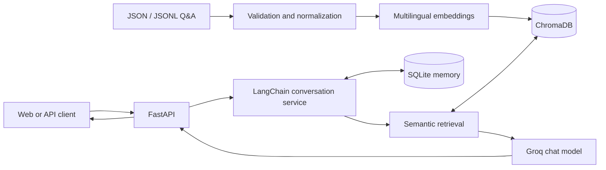
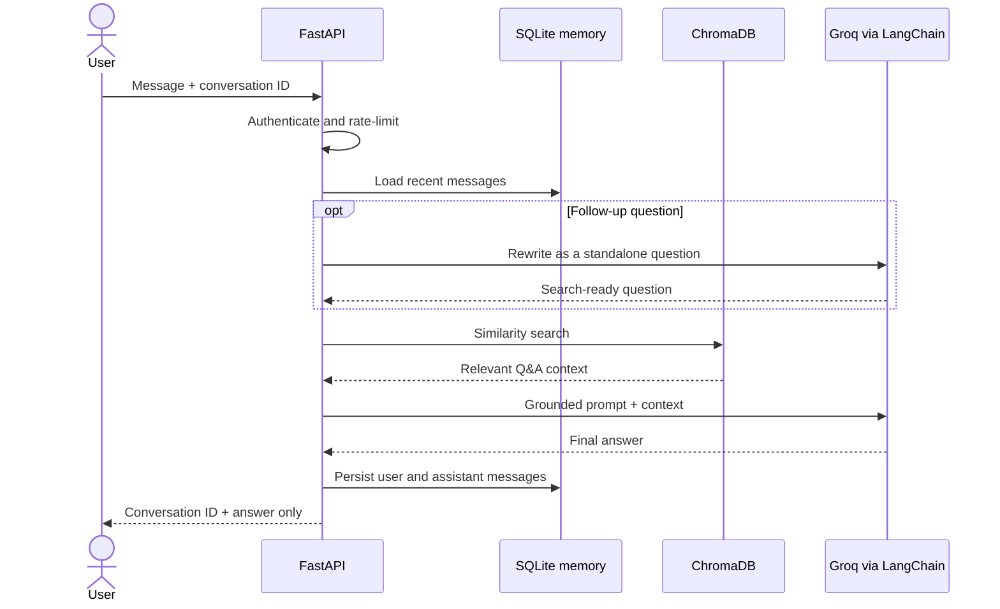

# Conversational RAG Platform

[](https://github.com/maha-meihemid/conversational-rag-platform/actions/workflows/ci.yml)
[](https://www.python.org/)
[](https://fastapi.tiangolo.com/)
[](https://python.langchain.com/)
[](https://www.trychroma.com/)
[](https://www.docker.com/)
[](LICENSE)

A production-oriented conversational RAG API for JSON and JSONL question-answer
knowledge bases. It combines LangChain, ChromaDB, multilingual embeddings, Groq,
FastAPI, and persistent session memory.

The platform is domain-independent. Product documentation, support FAQs, internal
policies, educational content, and other Q&A datasets can use the same pipeline
without code changes. The banking dataset is retained only as an optional example.

## Quick start

The fastest demonstration uses the included knowledge base. Python 3.12 and a
[Groq API key](https://console.groq.com/keys) are required.

```powershell
git clone https://github.com/maha-meihemid/conversational-rag-platform.git
Set-Location conversational-rag-platform
py -3.12 -m venv .venv
.\.venv\Scripts\Activate.ps1
python -m pip install -e ".[dev]"
Copy-Item .env.example .env
Copy-Item examples/knowledge_base.json data/raw/knowledge_base.json
```

Set `GROQ_API_KEY` and replace `APP_API_KEY` with a private random value in `.env`,
then prepare and index the example:

```powershell
python scripts/prepare_dataset.py
python scripts/index_knowledge_base.py
uvicorn app.main:app --reload
```

Open `http://127.0.0.1:8000`, enter the same `APP_API_KEY` in the interface, and
start a conversation. API documentation is available at
`http://127.0.0.1:8000/docs`.

For Linux or macOS, activate the environment with `source .venv/bin/activate` and
copy files with `cp`. All remaining Python commands are identical.

> The first indexing run downloads the multilingual embedding model and can take
> longer than later starts.

For a container-based launch and production checklist, see the
[deployment runbook](docs/DEPLOYMENT.md).

## Core capabilities

- Generic JSON and JSONL Q&A ingestion
- Deterministic validation, normalization, deduplication, and record identifiers
- Multilingual semantic retrieval with a local embedding model
- ChromaDB persistence and relevance filtering
- Grounded answers generated with Groq through LangChain
- Persistent, isolated conversation memory with SQLite
- Follow-up question rewriting before retrieval
- Configurable assistant profiles with immutable RAG safety rules
- FastAPI endpoints with validated public response models
- Responsive web interface for chat and assistant profile configuration
- Unit and API tests that do not call external model providers

## Architecture



ChromaDB stores knowledge records. SQLite stores chat messages by conversation ID.
These stores have separate responsibilities and can be replaced independently.

### Request lifecycle



## Knowledge-base format

The input must be a JSON array or a JSONL file. `question` and `answer` are required.
`category` and `source` are optional.

```json
[
  {
    "question": "How do I reset my password?",
    "answer": "Open account settings and select Reset password.",
    "category": "Account",
    "source": "Product documentation"
  },
  {
    "question": "How can I contact support?",
    "answer": "Use the support form on the Help page."
  }
]
```

When optional fields are missing, the pipeline uses `General` as the category and
the input filename as the source.

## Local setup

Requirements:

- Python 3.12
- Git

Create and activate the environment:

```powershell
py -3.12 -m venv .venv
.\.venv\Scripts\Activate.ps1
python -m pip install --upgrade pip
pip install -e ".[dev]"
Copy-Item .env.example .env
```

Add a Groq API key to `.env`:

```env
GROQ_API_KEY=your_key_here
```

Never commit `.env` or expose provider credentials to a client application.

### Environment configuration

The application reads its configuration from environment variables. Values provided
by the operating system or container take precedence over the local `.env` file.
Configuration is validated during startup, so invalid values fail early with a clear
error.

`APP_ENV` accepts `development`, `test`, or `production`. Retrieval and conversation
limits are bounded to prevent accidental resource-heavy configurations. The complete
list of supported variables and safe local defaults is available in `.env.example`.

### Secret management

`GROQ_API_KEY` and `APP_API_KEY` are application secrets. They are represented as
masked secrets inside the application and are never returned by the API. For local
development, keep them in the untracked `.env` file. Never add real keys to
`.env.example`.

In a production environment, inject the secret through the platform's environment
configuration instead of copying `.env` into the image. For example, PowerShell can
provide it to a local process without writing it to the repository:

```powershell
$env:GROQ_API_KEY = "your_key_here"
uvicorn app.main:app --host 0.0.0.0 --port 8000
```

Docker Compose reads the local `.env` file at runtime. Both `.gitignore` and
`.dockerignore` exclude local environment files, so secrets are neither committed nor
included in the Docker build context.

## Prepare a knowledge base

There are two supported workflows.

### Option A: prepare a local Q&A dataset

Copy the included generic example:

```powershell
Copy-Item examples/knowledge_base.json data/raw/knowledge_base.json
```

Alternatively, download the original banking example and convert it automatically
to the generic schema:

```powershell
python scripts/download_banking_example.py
```

Normalize and validate the selected input:

```powershell
python scripts/prepare_dataset.py
```

The command creates:

```text
data/processed/knowledge_base.jsonl
data/processed/quality_report.json
```

Custom paths are supported:

```powershell
python scripts/prepare_dataset.py --input path/to/my_knowledge_base.json
```

The input path can point to any local `.json` or `.jsonl` file. The source dataset
does not need to be copied into the repository when `--input` is provided.

### Option B: use an already prepared knowledge base

If the data is already normalized in the platform's processed JSONL format, copy it
directly to:

```text
data/processed/knowledge_base.jsonl
```

Then skip `scripts/prepare_dataset.py` and run the indexing command directly. Each
line must be a JSON object with these fields:

```json
{
  "id": "record_password_reset",
  "category": "Account",
  "question": "How do I reset my password?",
  "answer": "Open account settings and select Reset password.",
  "source": "Product documentation",
  "content": "Question: How do I reset my password?\nAnswer: Open account settings and select Reset password."
}
```

Use Option A when the local dataset contains only Q&A fields. It generates the
identifier and retrieval content automatically and is the safest default.

## Build and inspect the vector store

Create or update the local ChromaDB collection:

```powershell
python scripts/index_knowledge_base.py
```

The first run downloads the multilingual embedding model. Test retrieval without
calling Groq:

```powershell
python scripts/search_knowledge_base.py "How do I reset my password?"
```

## Assistant profile

The system prompt has two layers:

1. Immutable grounding and prompt-injection rules controlled by the application.
2. A use-case profile containing the assistant name, role, domain, tone, language,
   additional instructions, and fallback message.

Default profile values are configured in `.env`. The active profile can be read at:

```text
GET /api/v1/assistant-profile
```

Profile editing is disabled by default. For local administration, set:

```env
ASSISTANT_PROFILE_EDITING_ENABLED=true
```

The administration interface updates the structured profile through:

```text
PUT /api/v1/assistant-profile
```

The saved profile is stored in `data/assistant_profile.json`. Keep profile editing
disabled unless administrators need to update it.

## API authentication

Set a long, random application key in `.env` before using protected endpoints:

```env
APP_API_KEY=replace_with_a_long_random_value
```

Clients send this value in the `X-API-Key` header. Authentication protects chat,
conversation deletion, and assistant profile updates. The web page, health endpoint,
and read-only assistant profile endpoint remain public. If no application key is
configured, protected endpoints return `503` instead of running without authentication.

The web interface keeps the entered access key only in browser `sessionStorage`; it is
removed when the browser tab is closed.

## Rate limiting

Chat requests are limited per API key to protect the model provider and control costs.
Configure the limit in `.env`:

```env
RATE_LIMIT_REQUESTS=20
RATE_LIMIT_WINDOW_SECONDS=60
```

When the limit is reached, `POST /api/v1/chat` returns `429 Too Many Requests` and a
`Retry-After` header. Conversation deletion and assistant profile management are not
included in this limit.

The limiter is stored in the API process, which keeps the single-container deployment
simple and requires no extra service. Use a shared Redis-backed limiter when deploying
multiple API replicas.

## Groq retries and timeouts

Each Groq request has a configurable timeout and a small retry budget:

```env
GROQ_TIMEOUT_SECONDS=30
GROQ_MAX_RETRIES=2
```

The timeout prevents a slow provider or network connection from keeping an API request
open indefinitely. Retries handle short-lived provider and network failures. LangChain's
`ChatGroq` integration applies both settings to model calls, including question rewriting
when conversation history is present. Keep the retry count low to limit latency and cost.

## Structured logging

Application request logs are written as one JSON object per line. Configure their
minimum severity with:

```env
LOG_LEVEL=INFO
```

Each completed request records a generated request ID, HTTP method, route, status code,
and duration. The same identifier is returned in the `X-Request-ID` response header for
support and troubleshooting. API keys, request bodies, answers, and conversation history
are never included in request logs.

## Health and readiness

The public probe endpoints serve different purposes:

- `GET /api/v1/health` returns `200` when the API process is running.
- `GET /api/v1/ready` returns `200` only when required secrets are configured, the
  ChromaDB collection exists, and the conversation database is reachable.

Readiness returns `503 Service Unavailable` when a dependency is unavailable. It reports
only the state of each check and never exposes credentials or internal error messages.
Docker uses the readiness endpoint for its container health check.

## Metrics

Prometheus metrics are available at `http://127.0.0.1:8000/metrics`:

- `rag_http_requests_total` counts requests by method, route, and status code.
- `rag_http_request_duration_seconds` measures request duration by method and route.

Metric labels never contain API keys, questions, answers, or conversation identifiers.
In production, restrict access to `/metrics` at the reverse proxy or private network
level so that only the monitoring system can scrape it.

## Conversation memory

LangChain's `RunnableWithMessageHistory` manages the conversation lifecycle, while
`SQLChatMessageHistory` persists messages in `data/conversations.db`. Reuse the same
identifier to continue a session:

```powershell
python scripts/ask.py "How do I track my order?" --conversation-id demo
python scripts/ask.py "How long does it take?" --conversation-id demo
```

Before retrieval, follow-up questions are rewritten as standalone search questions
using recent messages from the same session.

## Chat API

Start the application:

```powershell
uvicorn app.main:app --reload
```

Swagger UI is available at `http://127.0.0.1:8000/docs`.

The web interface is available at `http://127.0.0.1:8000`. It provides a
session-aware chat and an assistant profile editor. The browser stores the conversation
identifier locally and the API access key for the current tab only. Sources, model
reasoning, Groq credentials, and chat history remain server-side.

Send a first message:

```powershell
$response = Invoke-RestMethod `
  -Method Post `
  -Uri http://127.0.0.1:8000/api/v1/chat `
  -Headers @{ "X-API-Key" = $env:APP_API_KEY } `
  -ContentType "application/json" `
  -Body '{"message":"How do I reset my password?"}'
```

Reuse `$response.conversation_id` to continue the same conversation. The public
response contains only `conversation_id` and `answer`. Retrieval sources, similarity
scores, model reasoning, and provider errors are not exposed.

Clear the session memory:

```powershell
Invoke-RestMethod `
  -Method Delete `
  -Uri "http://127.0.0.1:8000/api/v1/conversations/$($response.conversation_id)" `
  -Headers @{ "X-API-Key" = $env:APP_API_KEY }
```

## Verification

```powershell
pytest
ruff check .
mypy app scripts
```

Tests use in-memory histories and dependency overrides. They do not call Groq or
download embedding models.

Run one test layer at a time:

```powershell
pytest -m unit
pytest -m api
pytest -m integration
```

Generate a coverage report and enforce the configured 85% minimum:

```powershell
pytest --cov=app --cov-report=term-missing
```

### Continuous integration

GitHub Actions runs Ruff and the complete test suite with the 85% coverage threshold
on every push and pull request targeting `develop` or `main`. The CI workflow does
not require application secrets because tests mock or replace external services.

## Docker

Docker runs the API and web interface as a non-root user. The local `data` and
`chroma_db` directories are mounted into the container, so the knowledge base,
conversation memory, and assistant profile survive container restarts.

Create `.env` first, then build the image:

```powershell
docker compose build
```

If the source dataset is outside the repository, first prepare it locally with
`--input`, or copy it to `data/raw/knowledge_base.json` before running the container
commands. The `data` directory is mounted into the container.

Prepare and index a knowledge base through the same image when needed:

```powershell
docker compose run --rm api python scripts/prepare_dataset.py
docker compose run --rm api python scripts/index_knowledge_base.py
```

Start the platform:

```powershell
docker compose up -d
docker compose ps
```

Open `http://127.0.0.1:8000`. Stop the service without deleting persisted data:

```powershell
docker compose down
```

The `.dockerignore` file excludes local secrets, tests, caches, and runtime data
from the build context. The Groq API key is provided only at runtime through the
local `.env` file.

For HTTPS, reverse-proxy configuration, backup guidance, deployment verification,
and scaling constraints, follow [docs/DEPLOYMENT.md](docs/DEPLOYMENT.md).

## Local persistence

The following runtime artifacts are excluded from Git:

- `.env`
- `chroma_db/`
- `data/raw/`
- `data/processed/`
- `data/conversations.db`
- `data/assistant_profile.json`
