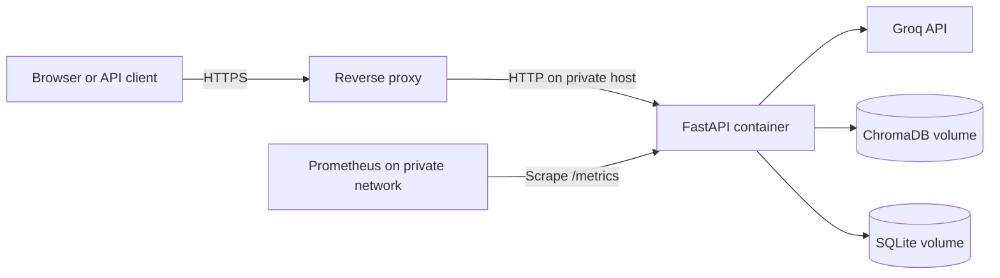

# Deployment runbook

This runbook covers a simple, production-oriented single-host deployment of the
Conversational RAG Platform. It uses Docker Compose, persistent host directories,
and an external HTTPS reverse proxy.

## Deployment model



The supplied Compose file runs one API replica. This matches the in-process rate
limiter and the SQLite conversation store. A multi-replica deployment requires a
shared rate limiter and a shared database before replicas can be added safely.

## 1. Host requirements

- Git
- Docker Engine with Docker Compose v2
- Outbound HTTPS access to Groq and the embedding-model registry
- An HTTPS reverse proxy such as Caddy, Nginx, or a managed load balancer
- Persistent disk space for `data/` and `chroma_db/`

Do not expose port `8000` directly to the public internet. Publish only the reverse
proxy's HTTPS port and restrict `/metrics` to the monitoring network.

## 2. Clone and configure

```bash
git clone https://github.com/maha-meihemid/conversational-rag-platform.git
cd conversational-rag-platform
cp .env.example .env
```

At minimum, set these values in `.env`:

```env
APP_ENV=production
APP_DEBUG=false
APP_API_KEY=replace_with_a_long_random_value
GROQ_API_KEY=replace_with_your_groq_key
ASSISTANT_PROFILE_EDITING_ENABLED=false
```

Generate the application API key with a trusted secret generator. Keep `.env`
readable only by the deployment account. Never place real secrets in the image,
Compose file, Git history, browser code, logs, or documentation.

Review retrieval settings, model selection, rate limits, and the assistant profile
in `.env.example` before the first launch.

## 3. Provide the knowledge base

Choose one workflow.

### Raw JSON or JSONL

Place the file at `data/raw/knowledge_base.json`. Each record requires `question`
and `answer`; `category` and `source` are optional. To keep a source file elsewhere
on the host, prepare it with the local Python workflow documented in the README;
only repository directories are mounted inside the container.

```bash
docker compose run --rm api python scripts/prepare_dataset.py
```

### Already prepared JSONL

Place the prepared file directly at:

```text
data/processed/knowledge_base.jsonl
```

It must follow the processed schema documented in the main README. Skip dataset
preparation in this case.

## 4. Build and index

```bash
docker compose build
docker compose run --rm api python scripts/index_knowledge_base.py
```

The first indexing operation downloads the embedding model. The resulting ChromaDB
collection is stored under `chroma_db/` and remains available across container
restarts.

Re-run preparation and indexing whenever the knowledge base changes. Stable record
identifiers allow existing records to be updated deterministically.

## 5. Start and verify

```bash
docker compose up -d
docker compose ps
docker compose logs --tail=100 api
```

Run the probes from the host:

```bash
curl --fail http://127.0.0.1:8000/api/v1/health
curl --fail http://127.0.0.1:8000/api/v1/ready
```

Expected results:

- `/api/v1/health` returns HTTP `200` when the process is alive.
- `/api/v1/ready` returns HTTP `200` when configuration, ChromaDB, and SQLite are
  ready.
- `docker compose ps` reports the container as healthy.
- A chat request with the `X-API-Key` header returns only `conversation_id` and
  `answer`.

If readiness returns `503`, inspect the container logs and confirm that secrets are
present, the knowledge base was indexed, and mounted directories are writable.

## 6. Put HTTPS in front of the API

Configure the reverse proxy to:

- terminate TLS with a valid certificate;
- forward normal application traffic to `127.0.0.1:8000`;
- preserve `Host` and forwarding headers;
- apply a reasonable request-body limit and proxy timeout;
- deny public access to `/metrics`;
- optionally restrict `/docs` and `/redoc` in production.

The application-level `X-API-Key` remains required for protected endpoints. HTTPS
is essential because it prevents that key and chat content from travelling in clear
text.

## 7. Persistence and backups

Back up these paths while preserving access controls:

| Path | Purpose | Rebuildable |
| --- | --- | --- |
| `data/processed/knowledge_base.jsonl` | Normalized knowledge base | Yes, from raw data |
| `chroma_db/` | Vector index | Yes, from processed data |
| `data/conversations.db` | Conversation memory | No |
| `data/assistant_profile.json` | Runtime assistant profile | Yes, from configuration |

For a consistent SQLite backup, stop the application briefly or use SQLite's online
backup mechanism. Test restoration regularly. Store backups outside the application
host and apply an appropriate retention policy for conversation data.

## 8. Operations

View recent logs:

```bash
docker compose logs --tail=200 api
```

Restart after configuration changes:

```bash
docker compose up -d --force-recreate
```

Rebuild after application updates:

```bash
git pull --ff-only
docker compose build
docker compose up -d
```

Stop the application without deleting persistent data:

```bash
docker compose down
```

Monitor request volume and latency by scraping `/metrics` from a private Prometheus
instance. Use the `X-Request-ID` response header to correlate client failures with
structured application logs.

## Pre-production checklist

- [ ] CI passes on the exact revision being deployed.
- [ ] `.env` contains real secrets and is not tracked by Git.
- [ ] `APP_ENV=production` and `APP_DEBUG=false` are set.
- [ ] The knowledge base is prepared, reviewed, and indexed.
- [ ] Health and readiness probes return HTTP `200`.
- [ ] HTTPS is enabled and port `8000` is not public.
- [ ] `/metrics` is restricted to the monitoring network.
- [ ] Persistent directories have sufficient disk space and correct permissions.
- [ ] Backups and a restoration test are in place.
- [ ] Rate limits and Groq cost limits match the expected traffic.
- [ ] A real multi-turn conversation has been tested through the public endpoint.
